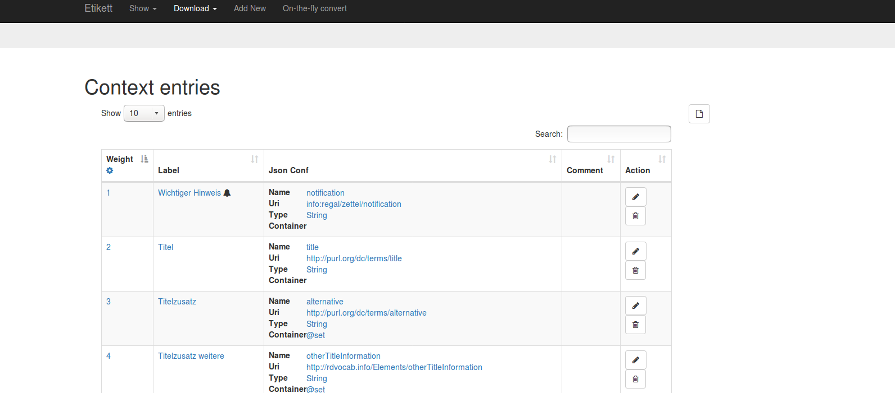

# etikett 

[](https://travis-ci.org/hbz/etikett)

etikett helps you to render URIs. URI rendering is a common use case when dealing with rdf data. 
 
- presentation of rdf data to end users - etikett stores labels and icon information 
- json-ld transformation from rdf database - etikett stores shortnames and types 

With etikett one can establish unified rdf handling to similar applications. 



# Requirements

## Java 8

`echo $JAVA_HOME //check if java 8 assigned`

## Typesafe Activator

```

cd /tmp
wget http://downloads.typesafe.com/typesafe-activator/1.3.2/typesafe-activator-1.3.2-minimal.zip
unzip typesafe-activator-1.3.2-minimal.zip
sudo mv activator-1.3.2-minimal /opt
```

# Run

## Download

```
cd /tmp
git clone https://github.com/hbz/etikett
cd etikett
```

## Run

This will start the application in developer mode. Some test data is loaded at startup

`/opt/activator-1.3.2-minimal/activator run`

Go to http://localhost:9000/tools/etikett

## Editing and Uploading

To edit/delete/upload data password authentification is required. Default user is admin. Default password is admin. To change the default password edit the application.conf:

`etikett.admin-password="admin"`

## Manual Test

List all

`curl "http://localhost:9000/tools/etikett" -H"accept: application/json"`

Or list info for a single uri

`curl "http://localhost:9000/tools/etikett?url=http%3A%2F%2Fpurl.orms%2Fissued" -H"accept: application/json"`

# Install on Ubuntu

``` 
cd /tmp/etikett
/opt/activator-1.3.2-minimal/activator dist
cp target/universal/etikett-0.1.0-SNAPSHOT.zip  /tmp
cd /tmp
unzip etikett-0.1.0-SNAPSHOT.zip
mv etikett-0.1.0-SNAPSHOT /opt/etikett
```


edit startscript

```

sudo cp /tmp/etikett/install/etikett.tmpl /etc/init.d/etikett
sudo chmod u+x /etc/init.d/etikett
sudo editor /etc/init.d/etikett
```

set the following vars

```

JAVA_HOME=/opt/java
HOME="/opt/etikett"
USER="user to run etikett"
GROUP="user to run etikett"
SECRET=`uuidgen` # generate a secret e.g. using uuidgen
PORT=9000
```

include into system start and shutdown

`sudo update-rc.d etikett defaults 99 20`

Create/Configure Mysql Table

```

mysql -u root -p
CREATE DATABASE etikett  DEFAULT CHARACTER SET utf8 DEFAULT COLLATE utf8_general_ci;
CREATE USER 'etikett'@'localhost' IDENTIFIED BY 'etikett';
GRANT ALL ON etikett.* TO 'etikett'@'localhost';
```

Set /opt/etikett/conf/application.conf

```
db.default.driver=com.mysql.jdbc.Driver
db.default.url="jdbc:mysql://localhost/etikett?characterEncoding=UTF-8"
db.default.user=etikett_test
db.default.password="etikett_test"
```

start

`sudo service etikett start`

# Update

```
rm -rf /tmp/etikett
cd /tmp
git clone https://github.com/hbz/etikett
cd /tmp/etikett
/opt/activator-1.3.2-minimal/activator dist
cp target/universal/etikett-0.1.0-SNAPSHOT.zip  /tmp
cd /tmp
unzip etikett-0.1.0-SNAPSHOT.zip
cp /opt/etikett/conf/application.conf /tmp/etikett-0.1.0-SNAPSHOT/conf
sudo service etikett stop
rm -rf /opt/etikett/*
mv /tmp/etikett-0.1.0-SNAPSHOT/* /opt/etikett/
sudo service etikett start
```
# Etikett internals


Just for documentation here is how etikett stores it's data interally as in 08.2018

Current status:

|    uri*    |    label    |    name*    | icon |    reference_type (default is String)    |    container    |    comment    |    weight    | type | multilangLabel |
|-----------|-----------|-----------|-----------|------------|-----------|-----------|-----------|-----------|-----------|

**'*'** are mandatory, all others are optional

**uri***: The rdf predicate 
**label**: A label you might want to use for display 
**name***: the name of the json element 
**icon**: use this to add an icon font 
**reference_type**: the json-ld type (default is String)
**container**: the json-ld container 
**comment**: a comment you might want to add 
**weight:** a weight you can use to display elements in the correct order
**type**: internal type of Etikett. Must be one of CACHE, CONTEXT, STORE
**multilangLabel**: of course you can specify labels in multiple languages 

Example:

```
{
  "uri" : "http://purl.org/dc/terms/alternative",
  "comment" : "",
  "label" : "Titelzusatz",
  "icon" : "",
  "name" : "alternative",
  "referenceType" : "String",
  "container" : "@set",
  "weight" : "3",
  "type" : "CONTEXT",
  "multilangLabel" : { }
}
```
converts to context entry ...
```
alternative": {
    "@id": "http://purl.org/dc/terms/alternative",
    "@container": "@set"
}
```
or (annotated context)
```
alternative": {
    "icon": "",
    "weight": "3",
    "comment": "",
    "@id": "http://purl.org/dc/terms/alternative",
    "label": "Titelzusatz",
    "@container": "@set"
}
```


# License

GNU AFFERO GENERAL PUBLIC LICENSE 
Version 3, 19 November 2007
